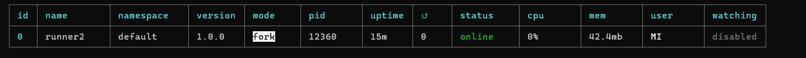
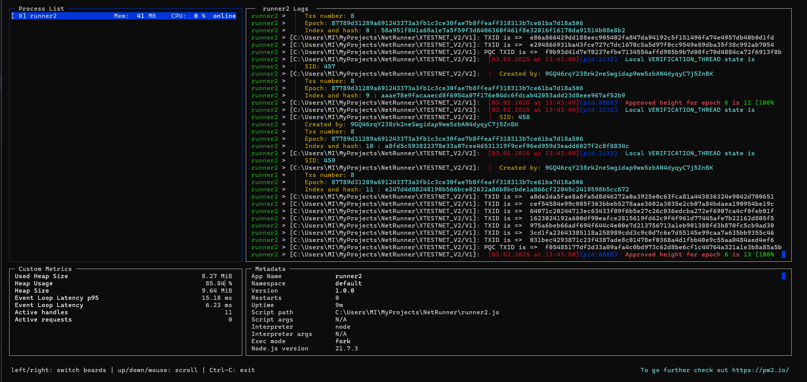
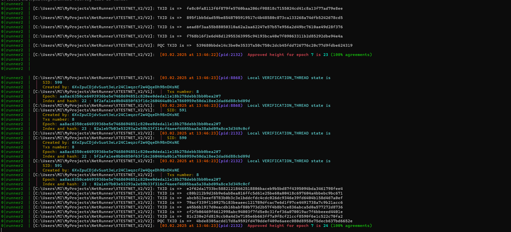

# Intro

This is the collection of files & scripts that should be used to help with local testnet management

<br/><br/>

# 1. Before run - you should build the Klyntar core

See https://docs.klyntar.org/build-core-and-join-network/run-kly-node

# 2. Switch to branch in core `dev`

```shell
git checkout mode_1
```

And install `web1337` by running:

```shell
pnpm install
```

> This is to generate mock transactions and fill the blocks

# 3. Now clone this repository in some another directory

```shell
git clone https://github.com/KlyntarNetwork/NetRunner.git

cd NetRunner
```

# 4. Prepare netrunner configs

See `netrunner_configs.json`

```json
{
    "corePath":"/full/path/to/KlyntarCore/klyntar_core.js",
    "mode":"testnet",
    "testnetDir":"TESTNET_V5"
}
```

Depending on network size - switch `testnetDir` to 3 possible options:

1. `TESTNET_V2`
2. `TESTNET_V5`
3. `TESTNET_V21`

<br/><br/>

# 5. Launch testnet with 2 validators

1. Your `netrunner_configs.json` should look like this:

```json
{
    "corePath":"/full/path/to/KlyntarCore/klyntar_core.js",
    "mode":"testnet",
    "testnetDir":"TESTNET_V2",
    "nodesIdsToDisable":[]
}
```

2. Then call

```shell
node setup.js
```
This should prepare directories for nodes of your testnet

3. Now update the timestamp

Change the timestamp for the first epoch for each node in your network

```shell
node update_timestamp_in_genesis.js
```

4. Finally - run your network

Just from a single shell

```shell
node runner.js 
```

<br/><br/>

# 6. Launch testnet with 5 validators

Your `netrunner_configs.json` should look like this:

```json
{
    "corePath":"/full/path/to/KlyntarCore/klyntar_core.js",
    "mode":"testnet",
    "testnetDir":"TESTNET_V5",
    "nodesIdsToDisable":[]
}
```

Then repeat:

```shell
node setup.js

node update_timestamp_in_genesis.js

node runner.js
```

<br/><br/>

# 7. Launch testnet with 21 validators

Your `netrunner_configs.json` should look like this:

```json
{
    "corePath":"/full/path/to/KlyntarCore/klyntar_core.js",
    "mode":"testnet",
    "testnetDir":"TESTNET_V21",
    "nodesIdsToDisable":[]
}
```

Then repeat:

```shell
node setup.js

node update_timestamp_in_genesis.js

node runner.js
```


# Using PM2 for production management


PM2 allows you to run services in the background, monitor server resource usage, write logs, and more.

> **PM2 is the recommended way to run and maintain a node (regular and validator) for Klyntar**

To run & work with a testnet you can use these simple commands:

### 1. Start a testnet in a single command:

```bash
pm2 start runner2.js
```

### 2. Check the active background services

You will see the following



### 3. Enter monitoring dashboard

```bash
pm2 monit runner2
```




### 4. Read the logs stream

```bash
pm2 logs runner2
```



### 5. Read last N lines of logs from stdout / stderr streams (`nostream` mode)

```bash
pm2 logs --lines <N> --nostream runner2
```

> ### Reading logs available even if the service was stopped - so it's useful to understand reasons of downtimes and so on

### 6. Stop a testnet

```bash
pm2 stop runner2
```

> ### When you stop the testnet and then run it again - the progress will be dropped and testnet will start from height 0 and epoch 0